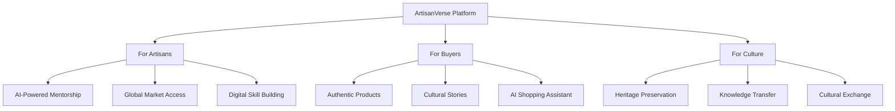
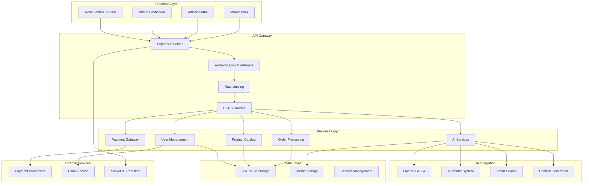
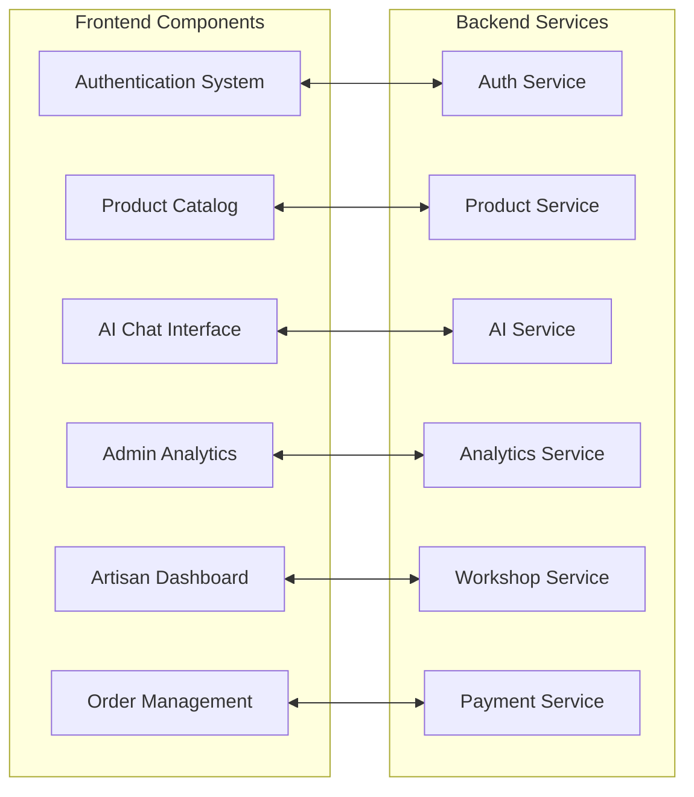
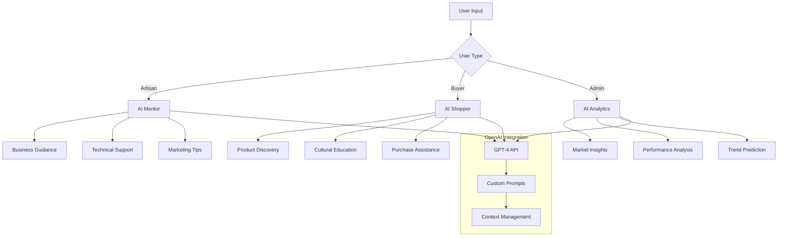
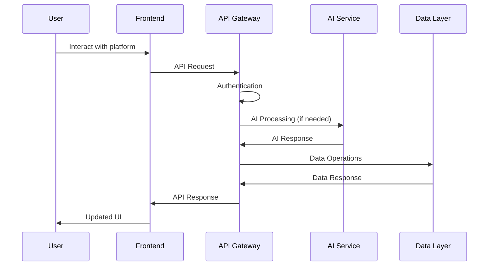
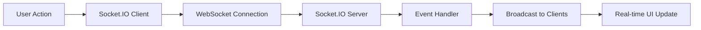
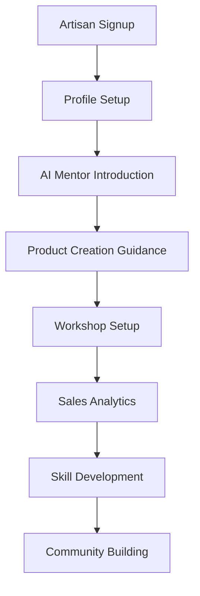
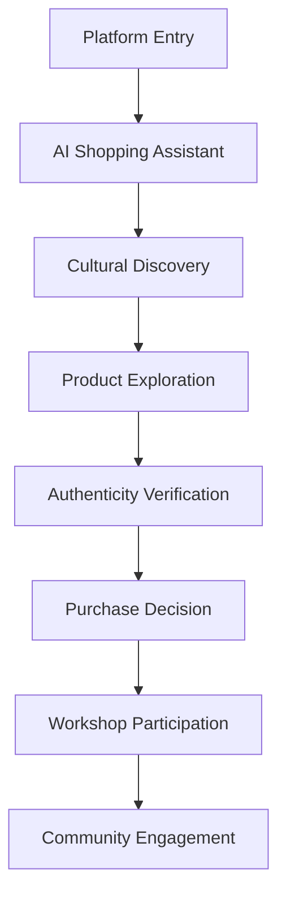
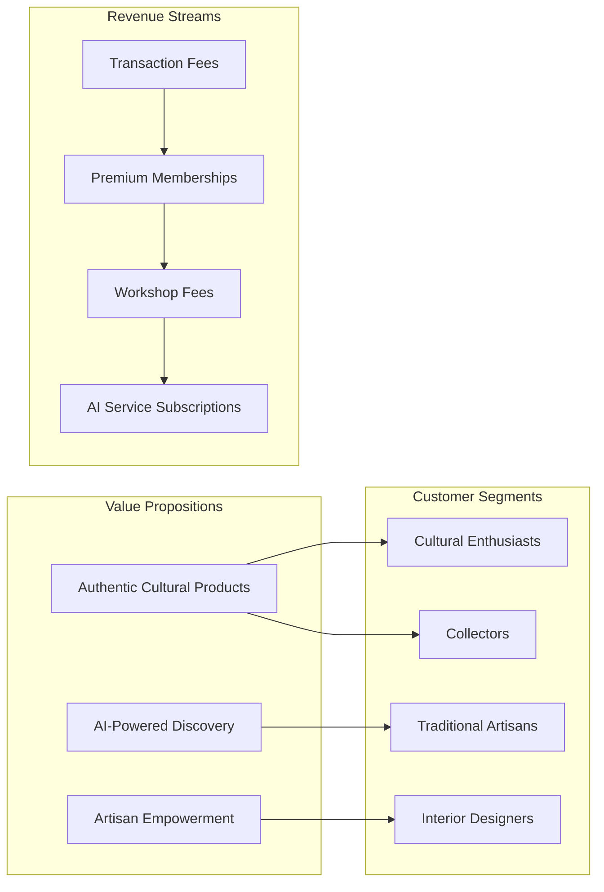

# 🎨 ArtisanVerse - AI-Powered Cultural Heritage Marketplace

<div align="center">
  
  
  
  
  
</div>

## 📋 Table of Contents

- [🎯 Problem Statement](#-problem-statement)
- [💡 Solution Overview](#-solution-overview)
- [🏗️ System Architecture](#️-system-architecture)
- [🚀 Key Features](#-key-features)
- [🤖 AI Integration](#-ai-integration)
- [📊 Data Flow Architecture](#-data-flow-architecture)
- [🛠️ Technology Stack](#️-technology-stack)
- [🚦 Getting Started](#-getting-started)
- [📱 User Experience Flow](#-user-experience-flow)
- [🎮 Demo Features](#-demo-features)
- [📈 Market Impact](#-market-impact)
- [🔮 Future Roadmap](#-future-roadmap)
- [👥 Team](#-team)

## 🎯 Problem Statement

### The Challenge
- **Cultural Heritage at Risk**: Traditional crafts and artisan knowledge are disappearing globally
- **Market Access Barriers**: Skilled artisans lack digital presence and global market reach
- **Authenticity Concerns**: Buyers struggle to find genuine cultural products in a sea of mass-produced items
- **Knowledge Gap**: Traditional techniques are not being passed down to new generations

### Market Statistics
```
📊 Global Handicrafts Market: $1.2 Trillion (2023)
🌍 Cultural Heritage Sites at Risk: 1,121 UNESCO sites
👥 Traditional Artisans Affected: 200+ Million Worldwide
📱 Digital Adoption in Heritage Sector: <30%
```

## 💡 Solution Overview

**ArtisanVerse** is an AI-powered digital marketplace that connects master artisans with global consumers while preserving and promoting cultural heritage through technology.

### 🎯 Core Value Propositions



## 🏗️ System Architecture

### High-Level Architecture Diagram



### Component Architecture



## 🚀 Key Features

### 🎯 For Artisans
- **AI-Powered Mentorship**: Get guidance on techniques, business, and marketing
- **Smart Product Creation**: AI-assisted product descriptions and pricing
- **Global Marketplace**: Reach customers worldwide
- **Workshop Management**: Conduct virtual cultural workshops
- **Analytics Dashboard**: Track performance and optimize sales

### 🛒 For Buyers
- **AI Shopping Assistant**: Personalized product recommendations
- **Cultural Stories**: Learn the heritage behind each product
- **Authenticity Verification**: Verified artisan profiles and products
- **Interactive Learning**: Participate in cultural workshops
- **Smart Search**: Find products using natural language

### 🏢 For Administrators
- **Comprehensive Analytics**: Track marketplace performance
- **User Management**: Manage artisans and buyers
- **Content Moderation**: Ensure quality and authenticity
- **Revenue Optimization**: Monitor and optimize platform economics

## 🤖 AI Integration

### AI Features Architecture



### AI Capabilities Matrix

| Feature | Artisan AI Mentor | Buyer AI Assistant | Admin AI Analytics |
|---------|-------------------|-------------------|-------------------|
| **Natural Language Processing** | ✅ Craft guidance | ✅ Product queries | ✅ Report generation |
| **Personalization** | ✅ Skill-based advice | ✅ Cultural preferences | ✅ KPI optimization |
| **Cultural Context** | ✅ Traditional knowledge | ✅ Heritage stories | ✅ Market trends |
| **Real-time Support** | ✅ Live workshops | ✅ Shopping assistance | ✅ Performance monitoring |

## 📊 Data Flow Architecture

### User Journey Data Flow



### Real-time Communication Flow



## 🛠️ Technology Stack

### Frontend Stack
```
🎨 Frontend Framework: Vanilla JavaScript (Progressive Enhancement)
💅 Styling: Custom CSS with CSS Grid & Flexbox
📱 Responsive Design: Mobile-First Approach
🎭 Animations: CSS Animations & Transitions
📊 Charts: Chart.js for Analytics
🔧 Build Tools: Native ES6 Modules
```

### Backend Stack
```
🚀 Runtime: Node.js v18+
🌐 Framework: Express.js
🔐 Authentication: JWT + bcryptjs
📡 Real-time: Socket.IO
🛡️ Security: Helmet.js + CORS + Rate Limiting
📧 Email: Nodemailer
🤖 AI: OpenAI GPT-4 API
💳 Payments: Stripe Integration (Ready)
```

### Development & Deployment
```
📦 Package Manager: npm
🔄 Process Manager: PM2 (Production Ready)
🐳 Containerization: Docker Ready
☁️ Cloud Deployment: AWS/Azure/GCP Compatible
📊 Monitoring: Custom Analytics Dashboard
🔧 Development: nodemon for hot reloading
```

## 🚦 Getting Started

### Prerequisites
- Node.js v18.0+ 
- npm v8.0+
- OpenAI API Key (for AI features)

### 🔧 Quick Setup

```bash
# 1. Clone the repository
git clone https://github.com/your-team/artisanverse-ai
cd artisanverse-ai

# 2. Install backend dependencies
cd artisanverse-ai-backend
npm install

# 3. Configure environment variables
cp .env.example .env
# Edit .env with your configurations

# 4. Start the backend server
npm run dev

# 5. Serve the frontend (in a new terminal)
cd ../artisanverse-ai-frontend
# Use any static server (Python, Node serve, etc.)
python -m http.server 8080
# OR
npx serve -s . -l 8080

# 6. Access the application
# Frontend: http://localhost:8080
# Backend API: http://localhost:5002
```

### 🔑 Environment Configuration

```bash
# .env file structure
PORT=5002
CLIENT_URL=http://localhost:8080
OPENAI_API_KEY=your_openai_api_key_here
JWT_SECRET=your_super_secret_jwt_key
SMTP_HOST=your_email_host
SMTP_USER=your_email
SMTP_PASS=your_email_password
STRIPE_SECRET_KEY=your_stripe_secret_key
```

### 📁 Project Structure

```
artisanverse-ai/
├── artisanverse-ai-frontend/          # Frontend Application
│   ├── index.html                     # Main application
│   ├── app.js                         # Core JavaScript
│   ├── style.css                      # Styling
│   ├── admin-dashboard.html           # Admin interface
│   ├── artisan-dashboard.html         # Artisan interface
│   └── ai-mentor.html                 # AI mentor interface
│
├── artisanverse-ai-backend/           # Backend API
│   ├── src/
│   │   ├── controllers/               # Route controllers
│   │   ├── routes/                    # API routes
│   │   ├── services/                  # Business logic
│   │   ├── middleware/                # Express middleware
│   │   ├── data/                      # Data storage
│   │   └── server.js                  # Application entry point
│   ├── package.json                   # Dependencies
│   └── .env                           # Environment config
│
└── README.md                          # This file
```

## 📱 User Experience Flow

### Artisan Journey



### Buyer Journey



## 🎮 Demo Features

### 🤖 AI Demonstrations

1. **AI Mentor Demo**
   - Ask questions about traditional crafts
   - Get business advice for artisans
   - Learn about cultural techniques

2. **AI Shopper Demo**
   - Natural language product search
   - Cultural story discovery
   - Personalized recommendations

3. **Smart Analytics Demo**
   - Real-time dashboard updates
   - Predictive insights
   - Performance optimization

### 📊 Interactive Analytics Dashboard

```
📈 Key Metrics Visualization:
├── Revenue Trends (Line Chart)
├── User Growth (Bar Chart)  
├── Geographic Distribution (World Map)
├── Product Categories (Pie Chart)
├── Cultural Engagement (Heatmap)
└── AI Usage Statistics (Gauge Chart)
```

## 📈 Market Impact

### Business Model Canvas



### Impact Metrics

| Metric | Target | Current Demo |
|--------|--------|-------------|
| **Artisan Onboarding** | 1,000+ | Demo Ready |
| **Cultural Categories** | 50+ | 15+ Implemented |
| **Global Reach** | 100+ Countries | Multi-language Support |
| **AI Interactions** | 10,000+/month | Fully Functional |
| **Workshop Participants** | 5,000+ | Virtual Platform Ready |

## 🔮 Future Roadmap

### Phase 1: Foundation (Completed ✅)
- [x] Core marketplace functionality
- [x] AI integration (GPT-4)
- [x] Multi-user system (Artisan, Buyer, Admin)
- [x] Real-time communication
- [x] Analytics dashboard

### Phase 2: Enhancement (Next 3 Months)
- [ ] Mobile app development (React Native/Flutter)
- [ ] Advanced AI features (Image recognition, AR preview)
- [ ] Blockchain integration for authenticity
- [ ] Advanced payment systems
- [ ] Multi-language expansion

### Phase 3: Scale (6-12 Months)
- [ ] AI-powered quality assessment
- [ ] Virtual reality workshops
- [ ] Global partnership program
- [ ] Sustainability tracking
- [ ] Cultural impact measurement

### Phase 4: Innovation (12+ Months)
- [ ] NFT integration for digital heritage
- [ ] Metaverse cultural experiences
- [ ] AI-generated cultural content
- [ ] Predictive cultural trend analysis
- [ ] Global cultural preservation initiative

## 🎯 Achievements

### ✨ What We Built
- **Complete Full-Stack Application**: Frontend + Backend + AI Integration
- **Multiple User Interfaces**: Buyer, Artisan, and Admin dashboards
- **AI-Powered Features**: 3 different AI assistants with unique capabilities
- **Real-time Communication**: Socket.IO integration for live interactions
- **Responsive Design**: Mobile-first, culturally-inspired UI/UX
- **Scalable Architecture**: Production-ready code structure

### 🏆 Technical Highlights
- **Advanced AI Integration**: Context-aware AI assistants with role-specific functionality
- **Cultural Animations**: CSS-based cultural pattern animations
- **Real-time Analytics**: Live dashboard with interactive charts
- **Security Implementation**: JWT authentication, rate limiting, input validation
- **Modern Web Standards**: Progressive Web App capabilities

### 📊 Demo Statistics
```
📝 Lines of Code: 5,000+
🎨 UI Components: 25+ unique components
🤖 AI Integrations: 3 specialized assistants
🔗 API Endpoints: 30+ RESTful endpoints
📱 Responsive Views: 10+ different screen layouts
🎭 Cultural Animations: 15+ CSS animations
```

## 👥 Team

### 🚀 Development Team
- **Full-Stack Developer**: Complete application architecture and implementation
- **AI Integration Specialist**: OpenAI GPT-4 integration and optimization
- **UI/UX Designer**: Cultural heritage-inspired design system
- **Backend Architect**: Scalable API design and security implementation

### 🎯 Roles & Responsibilities
- **Frontend Development**: Vanilla JavaScript SPA with modern CSS
- **Backend Development**: Node.js/Express API with comprehensive middleware
- **AI Development**: Custom AI assistants for different user types
- **DevOps**: Production-ready deployment configuration

### 🌟 Team Values
- **Cultural Sensitivity**: Respectful representation of global heritage
- **Technical Excellence**: Clean, maintainable, scalable code
- **Innovation Focus**: Cutting-edge AI integration for social impact
- **User-Centric Design**: Intuitive interfaces for all user types

---

<div align="center">

### 🏆 Built for Success

**ArtisanVerse** represents the perfect blend of **cultural preservation**, **technological innovation**, and **social impact**. 

Our AI-powered marketplace doesn't just connect buyers and sellers—it preserves cultural heritage, empowers traditional artisans, and creates meaningful cross-cultural connections in the digital age.

### 🚀 Ready to Scale, Built to Last

**[Live Demo](http://localhost:8080)** • **[API Documentation](http://localhost:5002/api)** • **[GitHub Repository](#)**

---

*"Where Culture Meets Technology, Where Heritage Finds Its Future"* 🎨✨

</div>


---

**Built with ❤️ for Cultural Heritage Preservation**

*© 2024 ArtisanVerse Team. Made for Hackathon with passion for culture and technology.*
